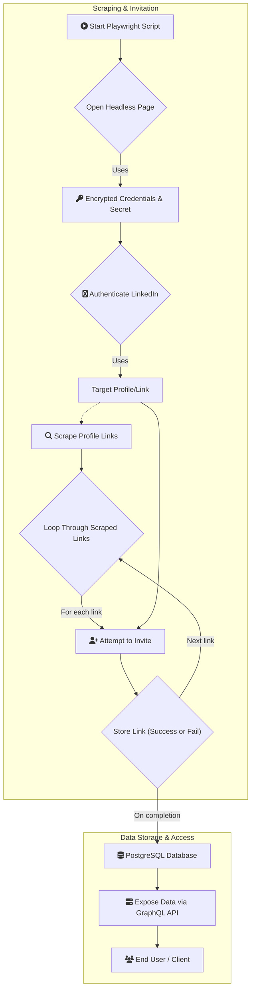

# ARCHITECTURE

This document provides a high overview of how this tool works.

# Goals

Reach different connections across LinkedIn for

- promotions
- marketing products
- reach potential hires

# What it does

Using [playwright](https://playwright.dev), we open a headless page and authenticate a LinkedIn profile using our *encrypted* credentials and *secret* (using AES-GCM encryption with WebCrypto API) to do the following:

1. Use a target profile or link to scrape LinkedIn profile links
2. Use scraped profile links and attempt to invite
3. Store links even if invites failed to PostgreSQL database
4. Expose data with a GraphQL API

> [!IMPORTANT]
> Some links actually point to the same profile since LinkedIn provides a **hashed** variant for said profile e.g.
> `linkedin.com/in/user` -> `linkedin.com/in/abcdefgh123`. Obviously, it won't make sense to create multiple
> hashes for one profile so at most, there are 2 links that point to 1 profile so deduplication can be ignored.
> We can expose, however, that they point to the same person when we expose the API

