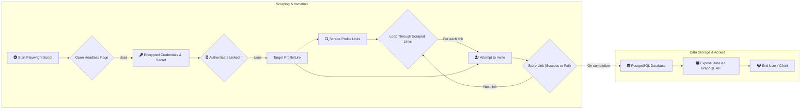

# ARCHITECTURE

This document provides a high overview of how this tool works.

# Goals

Reach different connections across LinkedIn for

- promotions
- marketing products
- reach potential hires

# What it does

Using [playwright](https://playwright.dev), we open a headless page and authenticate a LinkedIn profile using our *encrypted* credentials and *secret* (using AES-GCM encryption with WebCrypto API) to do the following:

1. Use a target profile or link to scrape LinkedIn profile links
2. Use scraped profile links and attempt to invite
3. Store links even if invites failed to PostgreSQL database
4. Expose data with a GraphQL API



> [!IMPORTANT]
> Some links actually point to the same profile since LinkedIn provides a **hashed** variant for said profile e.g.
> `linkedin.com/in/user` -> `linkedin.com/in/abcdefgh123`. Obviously, it won't make sense to create multiple
> hashes for one profile so at most, there are 2 links that point to 1 profile so deduplication can be ignored.
> We can expose, however, that they point to the same person when we expose the API

## Database Schema


| Name       | Links                         | IsConnected     |
| :--------- | :---------------------------- | :-------------- |
| John Doe   | `https://linkedin.com/in/...` | Yes             |
| Jane Smith | `https://linkedin.com/in/...` | No              |

We need two tables: 

- one for the scraper profile (since we might use different accounts)
- one for the links.

That's because the only unique identifier for
a link is its hash.

Of course, by default, we also have an ID already so the schema in SQL can look like these:

For the scraper profiles (we don't provide URLs for this. We assume that they are ephemeral and not
essential since we can always update the keys. They are only useful for logging. The *secret* is an encrypted auth
data):

```sql
CCREATE TABLE
    scraper_profiles (
        id UUID PRIMARY KEY DEFAULT gen_random_uuid (),
        secret TEXT NOT NULL,
        first_used TIMESTAMP NOT NULL DEFAULT CURRENT_DATE,
        last_used TIMESTAMP NOT NULL DEFAULT CURRENT_DATE,
        connections INT DEFAULT 0
    );
```

For links:

```sql
CREATE TABLE
    profile_links (
        id UUID PRIMARY KEY,
        first_fetched_on TIMESTAMP NOT NULL DEFAULT CURRENT_DATE,
        last_fetched_on TIMESTAMP NOT NULL DEFAULT CURRENT_DATE,
        member_id_url TEXT NOT NULL,
        clean_profile_url TEXT NOT NULL,
        connected BOOLEAN DEFAULT false,
        pending BOOLEAN DEFAULT false,
        name TEXT NOT NULL
    );
```

# Other features

## Feed Collection

There is a table for feeds of the currently used scraper profile.

```sql
CCREATE TABLE
    feeds (
        id UUID PRIMARY KEY DEFAULT gen_random_uuid (),
        post_url TEXT NOT NULL,
        first_fetched_on TIMESTAMP NOT NULL DEFAULT CURRENT_DATE,
        last_interacted_on TIMESTAMP NOT NULL DEFAULT CURRENT_DATE,
        note TEXT,
        UNIQUE (post_url)
    );
```

The collected data is used alongside the next feature that is mentioned below.

## Interactivity

The feed data is fetched from the `feeds` table. The page of the link will be interacted
based on the contents of the data. However, this interactivity requires

- feeding post data as input to an LLM (the model can vary)
- LLM outputs text to be used as comment on a post

To do this, a very well structured prompt is required so that the LLM is consistent on
outputting the necessary responses from its trained data. The following details are as follows
on how to create the prompt:

- Persona: The LLM should mimic a persona based on the provided input. Take for example,
if the post is about fintech, therefore, the LLM should mimic a financial analyst persona.
- Personality: The LLM should mimic a personality and behavior based on the tone of a post. However,
the LLM should be instructed to do at least one main personality e.g. cheerful and energetic.
- Adaptability: The LLM should adapt based on the content of a post. For example,
if a post talks about layoffs, then the LLM should focus more on the optimistic side rather than
on the pessimistic side of the responses. However, it's better to not be 100% on the optimistic
side to ensure "authenticity" of the responses.
- Goals: The LLM should be instructed to perform appropriate responses and focus on gaining more
connections.

A well structured schema is used to store these responses to be used for

- training a model
- provide more clearer and desired responses

